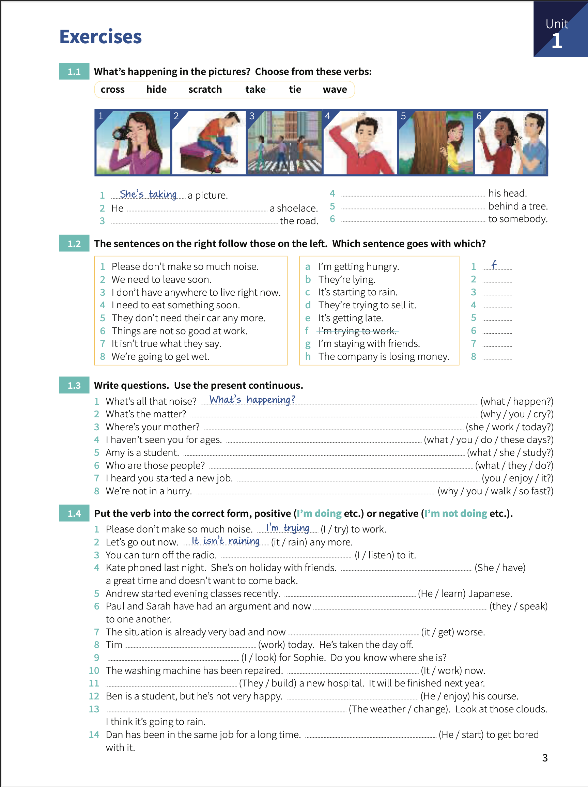

# Unit 1: Present continuous

## Concepts

> I started doing it and I haven't finished; I'm `in the middle of` doing it.
> 
> Sometimes the action is not happening at the time of speaking.
> 
> You can use the present continuous with `today`/`this week`/`this year` (periods around now)
> 
> Format: **subject + verb to be + ing**

## Exercises

1. What's happening in the pictures? Choose from these verbs:

   1. _She's taking_ a picture.
   2. He **'s tying up** a shoelace.
   3. **They're crossing** the road.
   4. **He's scratching** his head.
   5. **She's hiding** behind a tree.
   6. **They're waving** to somebody.

2. The sentences on the right follow those on the left. Which sentence goes with which?

   1. Please don't make so mucho nouse. _I'm trying to work_ - _F_.
   2. We need to leave soon. **It's getting late** - **E**.
   3. I don't have anywhere to live right now. **I'm staying with friends** - **G**.
   4. I need to eat something soon. **I'm getting hungry** - **A**.
   5. They don't need their car any more. **They're trying to sell it** - **D**.
   6. Thing are not so good at work. **The company is losing money** - **H**.
   7. It isn't true what they say. **They're lying** - **B**.
   8. We're going to get wet. **It's starting to rain** - **C**.

3. Write questiions. Use the present continuous.
   
   1. What's all that noise?. _What's happening?_.
   2. What's the matter?. **Why are you crying?**.
   3. Where's your mother? **Is she working today?**.
   4. I haven't seen you for ages. **What are you doing these days?**.
   5. Amy is a student. **What's she studying?**.
   6. Who are those people?. **What are they doing?**.
   7. I heard you started a new job. **Are you enjoying it?**.
   8. We're not in a hurry. **Why are you walking so fast?**.

4. Put the verb in the correct form, positive or negative.

   1. Please, don't make so much noise. _I'm trying_ to work.
   2. Let's go out now. _It isn't raining_ any more.
   3. You can turn off the radio. **I'm not listening** to it.
   4. Kate phoned last night. She's on holiday with friends. **She's having** a great time and doesn't want to come back.
   5. Andrew started evening classes recently. **He's learning** Japanese.
   6. Paul and Sarah have had an argument and now **They're speaking** to one another.
   7. The situation is already very bad and now **It's getting** worse.
   8. Tim **isn't working** today. He's taken the day off.
   9. **I'm looking** for Sophie. Do you know where she is?
   10. The washing machine has been repaired. **It's working** now.
   11. **They're building** a new hospital. It will ve finished next year.
   12. Ben is a student, but he's not very happy. **He isnt' enjoying** his course.
   13. **The wather is changing**. Look at those clouds. I think it's going to rain.
   14. Dan has been in the same job for a long time. **He's starting** to get bored with it.