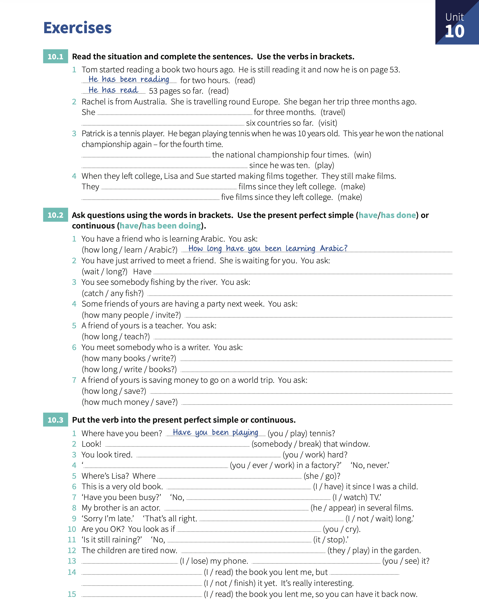

# Unit 10: Present perfect continuous and simple - `I have been doing` and `I have done`

## Concepts:

> We use the `present perfect continuos` yo say _how long_ (for something that is still happening).
> 
> We use the `present perfect` to say _how much_, _how many_ or _how many times_ (for completed actions).

## Exercises:

1. Read the situations and complete the sentences. Use the verbs in brackets.

   1. Tom started reading a book two hours ago. He is still reading it and now he is on page 53. _He has been reading_ for two hours. _He has read_ 53 pages so far.
   2. Rachel is from Australia. She is traveling round Europe. She began her trip three months ago. She **has been traveling** for three months. **She's visited** six countries so far.
   3. Patrick is a tennis player. He began playing tennis when he was 10 yeas old. This year he won the nation championship again - for the fourth time. **He's won** the national championship four times. **He's been playing** since he was ten.
   4. When they left college, Lisa and Sue started making films together. They still make films. They **'ve been making** films since they left college. **They've made** five films since they left college.

2. Ask questions using the words in brackets. Use the _present perfect_ simple (`have/has` done) or _present perfect continuous_ (`have/has` been doing).

    1. You have a friend who is learning Arabic. You ask: _How long have you been learning Arabic?_.
    2. You have just arrived to meet a friend. She is waiting for you. You ask: Have **you been waiting so long?**.
    3. You see somebody fishing by the river. You ask: **Have you catched any fish?**.
    4. Some friends of yours are having a party next week. You ask: **How many people have you invited?**.
    5. A friend of yours is a teacher. You ask: **How long have you been teaching?**.
    6. You meet somebody who is a writer. You ask: **How many books have you written?**. **How long have you been writing books?**.
    7. A friend of yours is saving money to go on a world trip. You ask: **How long have you been saving?**. **How much money have you saved?**.

3. Put the verb into the _present perfect_ or _present perfect continuous_.

    1. Where have you been?. _Have you been playing_ tennis?.
    2. Look!. **somebody has broken** that window.
    3. You look tired. **Have you been working** hard?.
    4. **Have you ever worked in a factory**?. No, never.
    5. Where's Lisa?. Where **has she gone**?.
    6. This is a very old book. **I've had** it since I was a child.
    7. Have you been busy?. No, **I've been watching** TV.
    8. My brother is an actor. **He's appeared** in several films.
    9.  Sorry I'm late. That's all right. **I haven't been waiting** long.
    10. Are you OK?. You look as if **you've been crying**.
    11. Is still raining?. No, **It's stopped**.
    12. The children are tired now. **They've played** in the garden.
    13. **I've lost** my phone. **Have you seen** it?
    14. **I've been reading** the book you lent me, but **I haven't finished** it yet. It's really interesting.
    15. **I've read** the book you lent me, so you can have it back now.