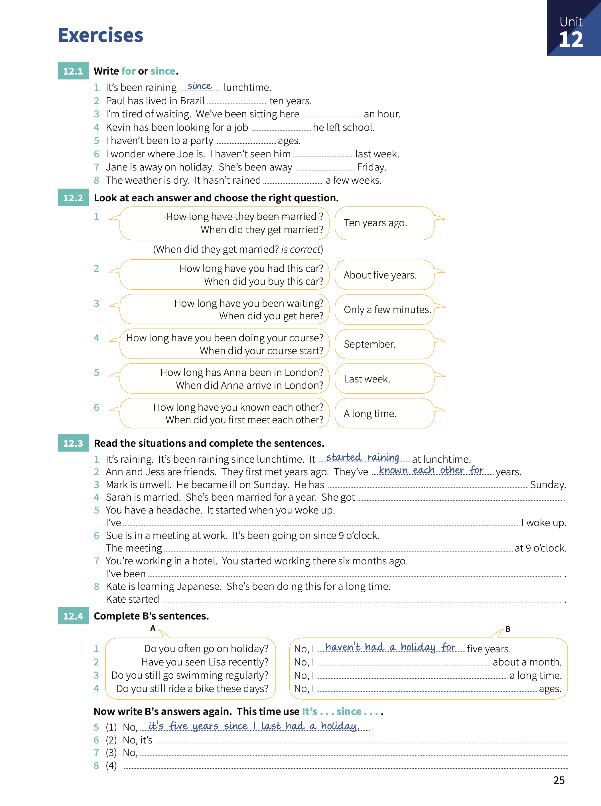

# Unit 12: `for` and `since`, `when..?` and `how long..?`.

## Concepts:

> We use `for` and `since` to say **how long** something has been happening.
> 
> `for` + _period of time_.
>
> We often leave out `for` but not usually in negative sentence. You can use `in` instead of `for` in _negative sentences_. We don't use `for` + `all`.
>
> `since` + _the start of the period_.

## Exercises:

1. Write `for` or `since`.

    1. It's been raining _since_ lunchtime.
    2. Paul has lived in Brazil **for** ten years.
    3. I'm tired of waiting. We've been sitting here **for** an hour.
    4. Kevin has been looking for a job. **since** he left school.
    5. I haven't been to a party **for** ages.
    6. I wonder where Joe is. I haven't seen him **since** last week.
    7. Jane is away on holiday. She's been away **since** Friday.
    8. The weather is dry. It hasn't rained **for** a few weeks.

2. Look at each answer and choose the right question.

    1. _When did they get married?_. Ten years ago.
    2. **How long have you had this car?** About 5 years.
    3. **How long have you been waiting?** Only a few minutes.
    4. **When did your course start?** September.
    5. **When did Anna arrive in London?** Last week.
    6. **How long have you known each other?** A long time.

3. Read the situations and complete the sentences.

    1. It's raining. It's been raining since lunchtimme. It _started raining_ at lunchtime.
    2. Ann and Jess are friends. They first meet years ago. They've **know each other for** years.
    3. Mark is unwell. He became ill on Sunday. He has **been ill since** Sunday.
    4. Sarah is married. She's been married for a year. She got ****

4. Complete B's sentences.
   
    1. Do you often go on holiday?. No, I _haven't had a holiday for_ five years.
    2. Have you seen Lisa recently?. No, I **havent' seen her for** about a month.
    3. Do you still go swimming regulary?. No, I **haven't swum for** a long time.
    4. Do you still ride a bike these days?. No, **I havent' ridden a bike for** ages.
    5. No, _It's five years since I last had a holiday_.
    6. No, It's **been on vacations since January**.
    7. No, **I haven't been swimming since yesterday**
    8. Yes. I've been riding a bike since 2006.