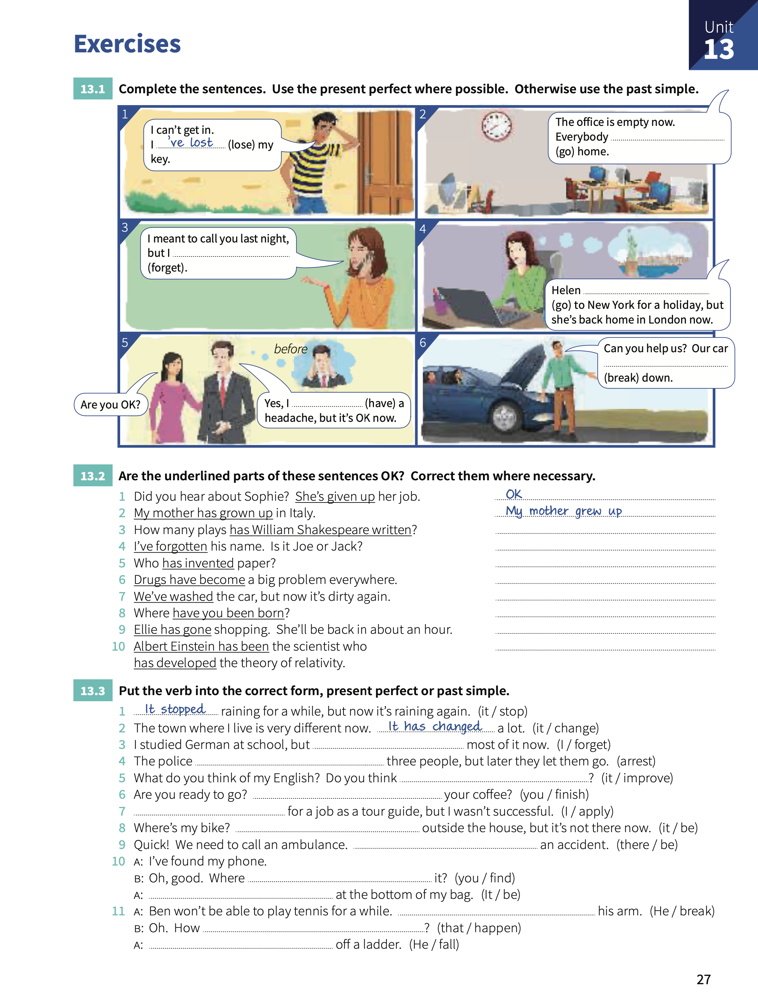

# Unit 13: Present perfect and past 1 - `I have done` and `I did`.

## Concepts:
> You can use _present perfect_ for **new or recent happenings**.
> 
> You can use _past simple_ for **not new or not recent things**
>
> **We use the present perfect to give new information**. But if we continue to talk about it, **we normally use the past simple**.

## Exercises:

1. Complete the sentences. use the _present perfect_ where possible. Otherwise use the _past simple_.

    1. I can't get in. I _'ve lost_ my key.
    2. The office is empty now. Everybody **went** home.
    3. I meant to call you last night, but I **fogot**.
    4. Helen **went** to New York for a holiday, but she's back home in London now.
    5. Are you OK?, Yes, I **'ve had** a headache, but it's OK now.
    6. Can you help us? Our car **broke** down.

2. Are the underlined parts of these sentences OK?. Correct them where necessary.

    1. Did you hear about Sophie?. _She's given up_ her job. - _OK_.
    2. _My mother has grown up_ in Italy. - _My mother grew up_.
    3. How many plays _has William Shakespeare written_?. - **wrote William Shakespeare?**.
    4. _I've forgotten_ his name. Is it Joe or Jack?. - **I forgot**.
    5. Who _has invented_ paper?. - **invented**.
    6. _Drugs have become_ a big problem everywhere. - **OK**.
    7. _We've washed_ the car, but now it's dirty again. - **We washed**
    8. Where _have you been born_?. - **did you born**/
    9. _Ellie has gone_ shopping. She'll be back in about an hour. - **OK**.
    10. _Albert Einstein has been_ the scientist who _has developed_ the theory of relativity. - **Albert Einstein was**.

3. Put the verb into the correct form, _present perfect_ or _past simple_.

    1. _It stopped_ raining for a while, but now it's raining again.
    2. The town where I live is very different now. _It's changed_ a lot.
    3. I studied German at school, but **I forgot** most of it now.
    4. The police **arrested** three people, but later they let them go.
    5. What do you think of my English?. Do you think **has it improved**?.
    6. Are you ready to go?. **Did you finish** your coffee?.
    7. **I applied** for a job as a tour guide, but I wasn't successful.
    8. Whare's my bike?. **It was** outside the house, but it's not there now.
    9. Quick!. We need to call an ambulance. **There has been** an accident.
    10. I've found my phone. Oh, good. Where **did you find** it?.
    11. Ben won't be able to play tennis for a while. **He's broken** his arm. Oh. How **did that happen**?. **He hell** off a ladder.