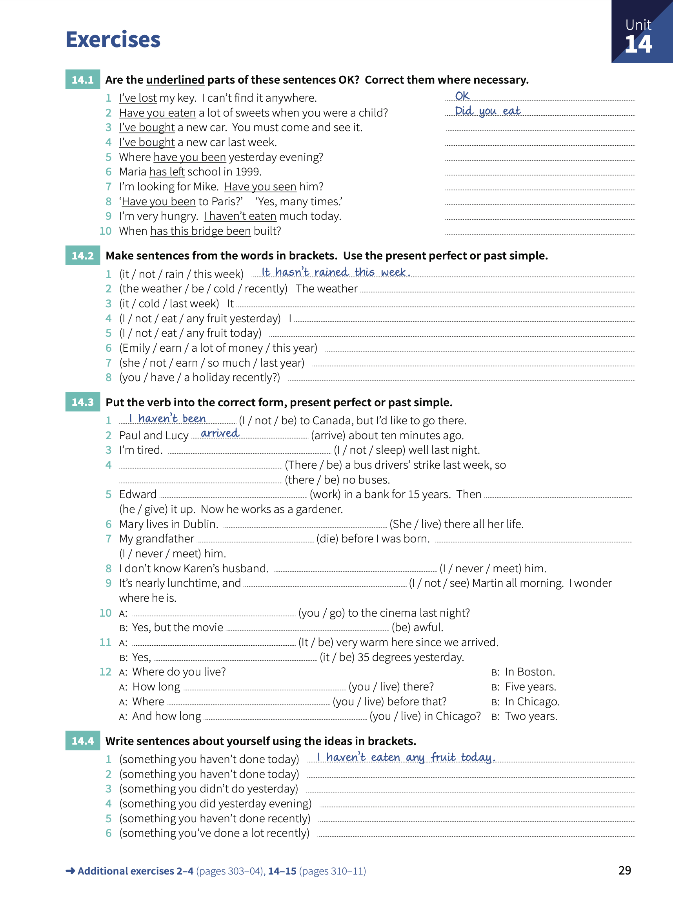

# Unit 14: Present perfect and pas 2 - `I have done` and `I did`

## Concepts:

> We use _present simple_ when we talk about a **finished** time. For example: `yesterday`, `last year`, `ten minutes ago`, etc.
>
> We use the _present perfect_ for a **period of time** that continues **until now**. For example: `today`, `this week`, `since 2010`, etc.
>
> Use the _past simple_ to ask `When...` or `What time ...`

## Exercises:

1. Are the underlined parts of these sentences OK?.  Correct them where necessary.

    1. _I've lost_ my key. I can't find it anywhere. - **OK**.
    2. _Have you eaten_ a lot of sweets when you were a child?. - _Did you eat_.
    3. _I've bought_ a new car. You must come and see it. - **OK**.
    4. _I've bought_ a new car last week. - **I bought**.
    5. Where _have you been_ yesterday evening?. - **were you**.
    6. Maria _has left_ school in 1999. - **left**.
    7. I'm looking for Mike. _Have you seen_ him?. - **Did you see**.
    8. _Have you been_ to Paris?. Yes, many times. **OK**.
    9. I'm very hungry. _I haven't eaten_ much today. - **OK**.
    10. When _has this bridge been_ built?. - **was this bridge build**.

2. Make sentences from the words in brackets. Use the _present perfect_ or _past simple_.

    1. _It hasn't rained this week_.
    2. The weather **has been cold recently**.
    3. It **was cold last week**.
    4. I **didn't eat any fruit yesterday**.
    5. **I haven't eaten any fruit today**.
    6. **Emily's earned a lot of money this year**.
    7. **She didn't earn so much money last year**.
    8. **Have you had a holiday recently**?.

3. Put the verb into the correct form, _present perfect_ or _past simple_.

    1. _I haven't been_ to Canada, but I'd like to go there.
    2. Paul and Lucy _arrived_ about ten minute ago.
    3. I'm tired. **I didn't sleep** well last night.
    4. **There were** a bus drivers' strike last week, so **There were** no buses.
    5. Edward **'s worked** in a bank for 15 years. Then **gave** it up. Now he works as a gardener.
    6. Mary lives in Dublin. **She's lived** there all her life.
    7. My grandfather **died** before I was born. **I never met** him.
    8. I don't know Karen's hunband. **I never met** him.
    9. It's nearly lunchtime, and **I didn't see** Martin all morning. I wionder where he is.
    10. **Did you** go to the cinema last night?. Yes, but the movie **was** awful.
    11. **It's been** very warm here since we arrived. Yes, **It was** 35 degrees yesterday.
    12. Where do you live?. In boston. How long **have you lived** there?. Five years. Where **did you live** before that?. In Chicago. And how long **have you lived** in Chicago?. Two years.

4. Write sentences about yourself using the ideas in brackets.

    1. _I haven't eaten any fruit today_.
    2. **I haven't played football today**.
    3. **I didn't watch TV yesterday**.
    4. **I went to sleep early yesterday evening**.
    5. **I haven't cleaned my office recently**.
    6. ***I've played a lot with my children recently*.