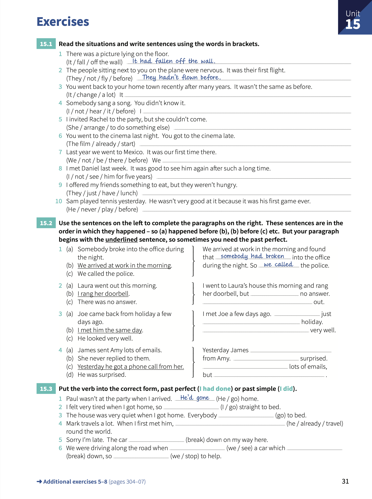

# Unit 15: Past perfect - `I had done`

## Concepts:
> `subject` + `had` + `past participle`.
>
> The past is the starting point of the story. If we want to talk about things that happeneded before this time, we use the _past perfect_.

## Exercises:

1. Read the situations and write sentences using the words in brackets.

    1. There was a picture lying on the floor. _It had fallen off the wall_.
    2. The people sitting next to you on the plane were nervous. It was their first flight. _They hadn't flown before_.
    3. You went back to your home town recently after many years. It wasn't the same as before. **It'd changed a lot**.
    4. Somebody sang a song. You didn't know it. **I hadn't heard it before**.
    5. I invited Rachel to the party, but she couldn't come. **She'd arraged to do something else**.
    6. You went to the cinema last night. You got to the cinema late. **The film had already started**.
    7. Last year we went to Mexico. It was our first time here. **We hadn't been there before**.
    8. I met Daniel last week. It was good to see him again after such a long time. **I hadn't seen him for five years**.
    9. I offered my friends something to eat, but they weren't hungry. **They'd just had lunch**.
    10. Sam played tennis yesterday. He wasn't very good at it because it was his first game ever. **He'd never played before**.

2. Use the sentences on the left to complete the paragraphs on the right. These sentences are in the order in which they happened.

    1. We arrived at work in the morning and found that _somebody had broken_ into the office during the night. So _we called_ the police.
    2. I went to Laura's house this morning and rang her doorbell, but **there was** no answer. Laura went out.
    3. I met Joe a few days ago. **He'd** just **come back from** holiday. **He looked** very well.
    4. Yesterday James **got a phone call** from Amy. **He was** surprised. **James had sent** lots of emails, but **she'd never replied to them**.

3. Put the ver into the correct form, _past simple_ or _past perfect_.

    1. Paul wasn't at the party when I arrived. _He'd gone_ home.
    2. I felt very tired when I got home, so **I went** straight to bed.
    3. The house was very quiet when I got home. Everybody **had gone** to bed.
    4. Mark travels a lot. When I first met him, **He'd already traveled** round the world.
    5. Sorry I'm late. The car **broke** down on my way here.
    6. We were driving along the road when **we saw** a car which **broke** down, so **we stopped** to help.
