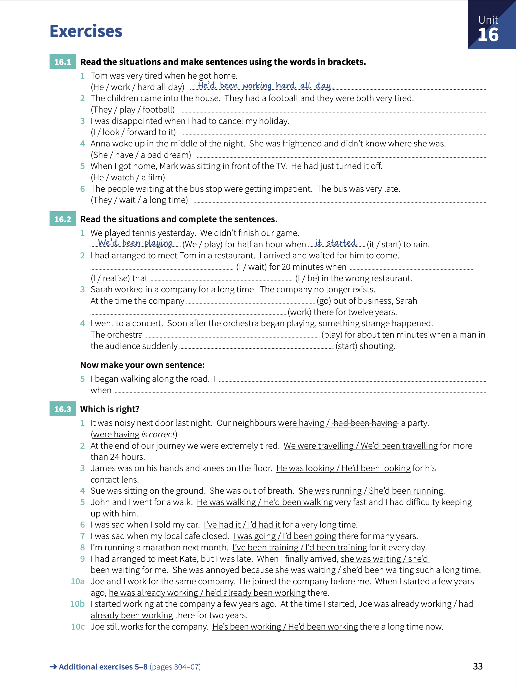
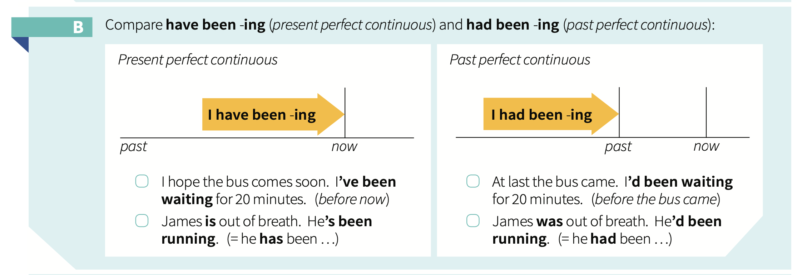

# Unit 16: Past perfect continuous - `I had been doing`

## Concepts:
> `subject` + `had` + `past participle` + `-ing`.

## Exercises:

1. Read the situations and make sentences using the words in brackets.

    1. Tom was very tired when he got home. _He'd been working hard all day_.
    2. The children came into the house. They had a football and they were both very tired. **They'd been playing football**
    3. I was disappointed when I had to cancel my holiday. **I'd been looking forward to it**.
    4. Anna woke up in the middle of the night. She was frightened and didn't know where she was. **She'd been having a bad dream**.
    5. When I got home, Mark was sitting in front of the TV. He had just turned it off. **He'd been watching a film**.
    6. The people waiting at the bus stop were getting impatient. The bus was very late. **They'd been waiting a long time**.

2. Read the situations and complete the sentences.

    1. We played tennis yesterday. We didn't finish our game. _We'd been playing_ for half an hour when _it started_ to rain.
    2. I had arranged to meet Tom in a restaurant. I arrived and waited for him to come. **I'd been waiting** for 20 minutes when **I realized** that **I was** in the worong restaurant.
    3. Sarah worked in a company for a long time. The company no longer exists. At the time the company **went** out of business. Sarah **'d been working** there for twelve years.
    4. I went to a concert. Soon after the orchestra began playing, something strange happened. The orchestra **'d been playing** for about ten minutes when a man in the audience suddenly **started** shouting.
    5. I began walking along the road. I **'d been walking** when **I realized I was missing my mobile phone**.

3. Which is right?

    1. I was noisy next door last night. Our neighbours _were having_ a party.
    2. At the end of our journey we were extremely tired. **We'd been traveling** for more that 24 hours.
    3. James was on his hands and knees on the floor. **He'd been looking** for his conotact lens.
    4. Sue was sitting on the ground. She wwas out of breath. **She'd been running**.
    5. John and I went for a walk. **He'd been walking** very fast and I had difficulty keeping up with him.
    6. I was sad when I sold my car. **I've had it** for a very long time.
    7. I was sad wwhen my local cafe closed. **I'd been going** there for may years.
    8. I'm running a marathon next month. **I've been training** for it every day.
    9. I had arranged to meet Kate, but I was late. When I finally arrived, **She'd been waiting** for me. She was annoyed because **She was waiting** such a long time.
    10. Joe and I work for the same company. He joined the company before me. When I started a few years ago, **He'd already been working** there.
    11. I started working at the company a few years ago. At the time I started, Joe **had already been working** there for two years.
    12. Joe still works for the company. **He's been working** there a long time now.