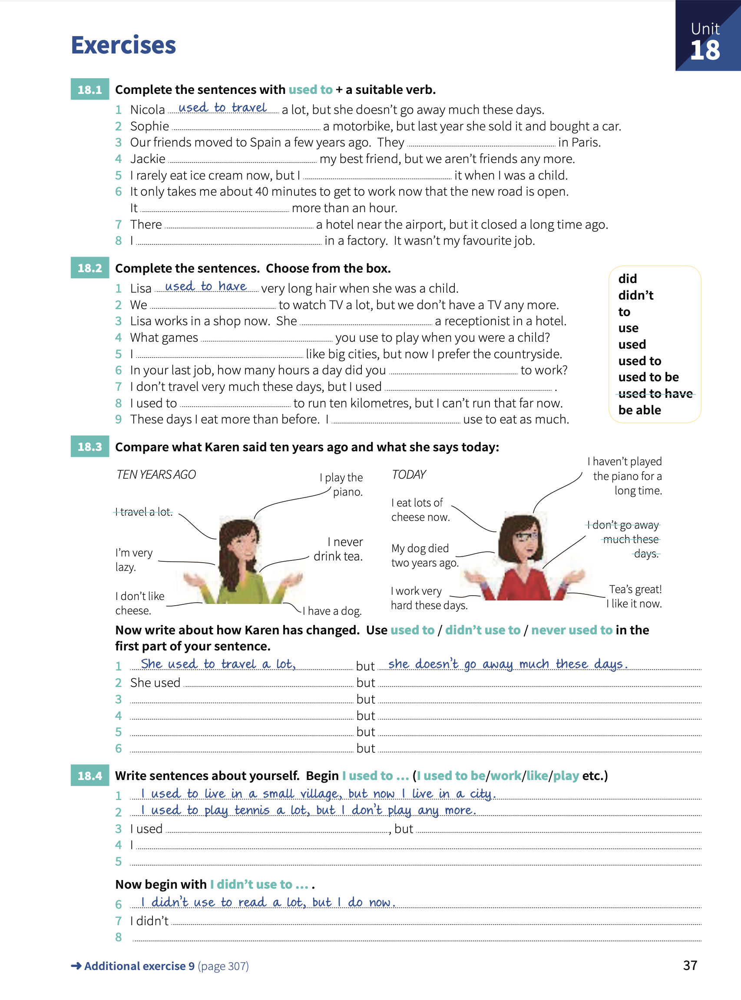

# Unit 18: `used to` (do)

## Concepts:
> _past_----(used to)---_now_
>
> `used to` means _I dit it often in the past, but not any more_.
> Use `used to` for things that were true, but are not true anymore.
>
> Questions:
>
> `Did` + `subject` + `used to` + .. 
>
> `Didn't` + `use to` + ..

## Exercises:

1. Complete the sentences with `used_ to` + suitable verb.

    1. Nicola _used to travel_ a lot, but she doesn't go away much these days.
    2. Sophie **used to drive** a motorbike, but last year she sold it and bought a car.
    3. Our friends moved to Spain a few years ago. They **used to live** in Paris.
    4. Jackie **used to be** my best friend, but we aren't friends any more.
    5. I rarely eat ice cream now, but I **used to eat** it when I was a child.
    6. It only takes me about 40 minutes to get to work now that the new road is open. It **used to take** more than an hour.
    7. There **used to be** a hotel near the airport, but it closed a long time ago.
    8. I **used to work** in a factory. It wasn't my favourite job.

2. Complete the sentences. Choose from the box.

    1. Lisa _used to have_ very long hair when she was a child.
    2. We **used** to watch TV a lot, but we don't have a TV any more.
    3. Lisa works in a shop now. She **used to be** a receptionist in a hotel.
    4. What games **did** you use to play when you were a child?
    5. I **used to** like big cities, but now I prefer the countryside.
    6. In your last job, how many hours a day did you **use** to work?.
    7. I don't travel very much these days, but I used **to**.
    8. I used to **be able** to run ten kilometers, but I can't run that far now.
    9. These days I eat more than before. I **didn't** use to eat as much.

3. Compare what Karen said ten years ago and what she says today.

    1. _She used to travel a lot_, but _She doesn't go away much these days_.
    2. She used **to play the piano*, but **She hasn't played the piano for a long time**.
    3. **She never used to drink tea**, but **She likes tea now**.
    4. **She used to have a dog**, but **She doesn't have a dog now**.
    5. **She didn't use to like cheese**, but **She eats a lot of cheese now**.
    6. **She used to be very lazy**, but **She works very hard these days**.

4. Write sentences about yourself. Begin `I used to ..` (I used to be/work/like/play/etc).

    1. _I used to live in a small village, but now I live in a city_.
    2. _I used to play tennis a lot, but I don't play any more_.
    3. I used **to work 12 hours per day**, but **I don't work more than 8 hour per day now**.
    4. I **used to sleep 5 hour per day**, but **I slepp 10 hours per day now**.