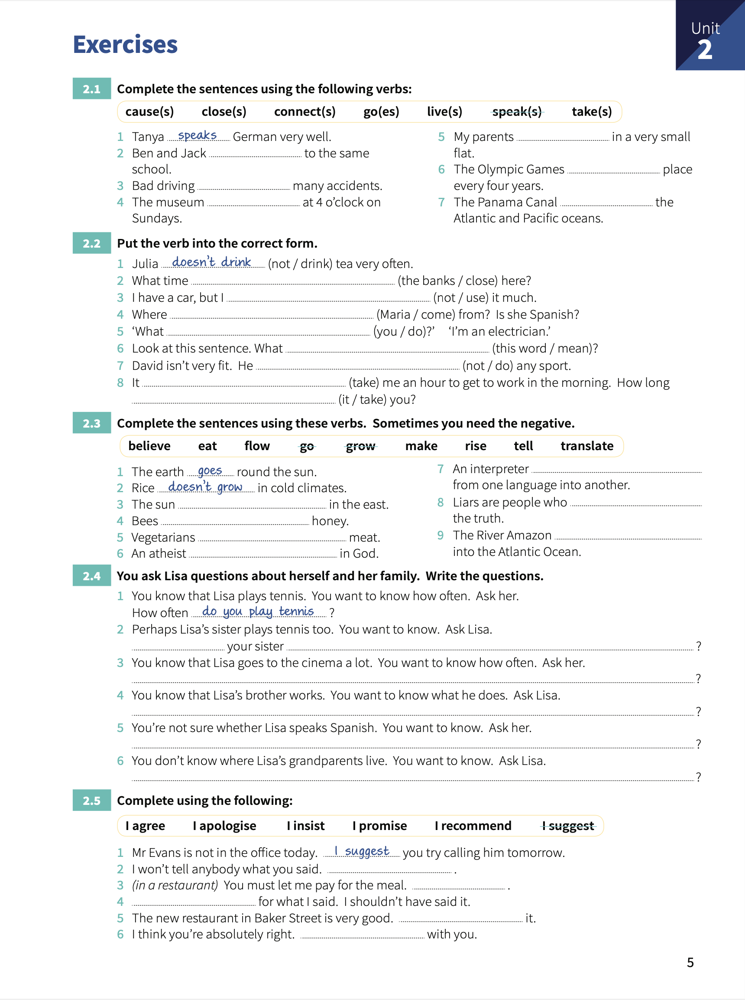

# Unit 2: Present simple (_I do_)

## Concepts

> We use the present simple to talk about:
> 1. Things in general.
> 2. Something happens all the time or repeatedly.
> 3. Something is true in general.
>
> We use `do/does` to make questions and negative sentences.
> 
> We use present simple to say `how often` we do things.

## Exercises.

1. Complete the sentences using the following verbs.
   
   1. Tanya _speaks_ German very well.
   2. Ben and Jack **go** to the same school.
   3. Bad driving **causes** many accidents.
   4. The museum ***closes* at 4 o'clock on Sundays.
   5. My parents **live** in a very small flat.
   6. The Olympic Games **take** place every four years.
   7. The Panama Canal **connects** the Atlantic and Pacific oceans.

2. Put the verb into the correct form.
   
   1. Julia _doesn't drink_ tea very often.
   2. What time **the bank closes** here?.
   3. I have a car, but I **don't use** it much.
   4. Where **does Maria come** from?. Is she Spanish?.
   5. What **do you do**?. I'm an electrician.
   6. Look a this sentence. What **does this work mean**?
   7. David isn't fit. He **doesn't do** any sport.
   8. It **takes** me and hour to get to work in the morning. How long **does it take** you?.

3. Complete the sentences using these verbs. Sometimes you need the negative.
   
   1. The earth _goes_ round the sun.
   2. Rice _doesn't grow_ in cold climates.
   3. The sun **rises** in the east.
   4. Bees **makes** honey.
   5. Vegetarians **don't eat** meat.
   6. An atheist **doesn't believe** in God.
   7. An interpreter **translates** from one language into another.
   8. Liars are people who **don't tell** the truth.
   9. The River Amazon **flows** into the Atlantic Ocean.

4. You ask Lisa questions about herself and her familiy. Write the questions.

    1. You know that Lisa plays tennis. You want to know how often. Ask her.
    How often _do you play tennis_?
    2. Perhaps Lisa's sister plays tennis too. You want to know. Ask Lisa.
    **Does** your sister **play tennis**?.
    3. You know that Lisa goes to the cinema a lot. You want to know how often. Ask her.
    **How often do you go to the cinema?**.
    4. You know that Lisa's brother works. You want to know what he does. Ask Lisa.
    **What does your brother do?**.
    5. You're not sure whether Lisa speaks Spanish. You want to know. Ask her.
    **Do you speak Spanish?**.
    6. You don't know where Lisa's grandparents live. You want to know. Ask Lisa.
    **Where do your grandparents live?**.

5. Complete using the following:

    1. Mr Evans is not in the office today. _I suggest_ you try calling him tomorrow.
    2. I won't tell anybody what you said. **I promise**.
    3. You must let me pay for the meal. **I insist**.
    4. **I apologise** for what I said. I shouldn't have said it.
    5. The new restaurant in Baker Street is very good. **I recommend** it.
    6. I think you're absolutely right. **I agree** with you.