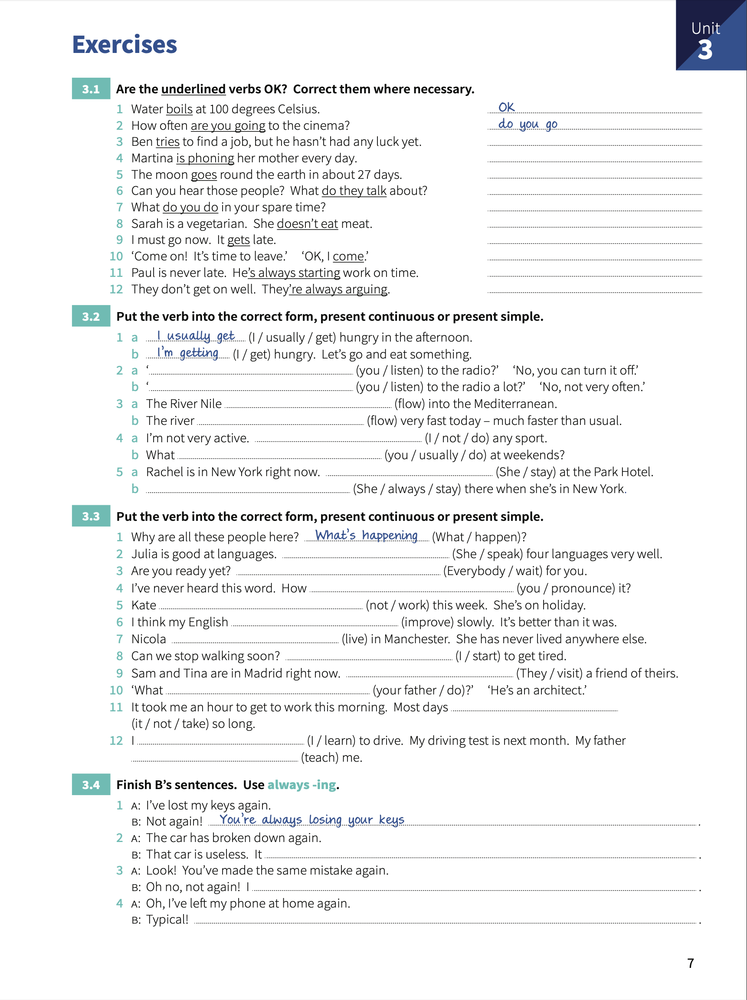

# Unit 3: Present continuous and present simple 1 - _I'm doing_ and _I do_

## Concepts:

### Present continuous
> Things happening at or arount the time of speaking. The action is not complete.
>
> We use it for `temporary` situations.

### Present simple
> Things in general of things that happen repeatedly.
>
> We use the simple for `permanent` situations.

## Exercises

1. Are the underlined verbs OK? Correct them where necessary.

    1. Water _boils_ at 100 degrees Celsius. - _OK_.
    2. How often _are you going_ to the cinema? - _do you go_.
    3. Ben _tries_ to find a job, but the hasn't had any luck yet. - **is trying**.
    4. Martina _is phoning_ her mother every day. - **phones**.
    5. The moon _goes_ round the earth in about 27 days. - **OK**.
    6. Can you heard those people? What _do they talk_ about? - **are they talking**.
    7. What _do you do_ in your spare time? - **OK**.
    8. Sarah is vegetarian. She _doesn't eat_ meat. - **OK**.
    9. I must go now. It _gets_ late. - ***is getting*.
    10. Come on! It's time to leave. OK, _I come_. - **I'm comming**.
    11. Paul is never late. He _'s always starting_ work on time. - **OK**.
    12. They don't get on well. They'_re always arguing_. - **OK**.

2. Put the verb into the correct form, present continuous or present simple.

    1. _I usually get_ hungry in the afternoon.
    _I'm getting_ hungry, Let's go and eat something.
    2. **Are you listening** to the radio?. No, you can turn it off.
    **Do you listen** to the radio a lot?. No, not very often.
    3. The River Nile **flows** into the Mediterranean.
    The river **is flowing** very fast today - much faster than usual.
    4. I'm not very active. **I don't do** any sport.
    What **do you usually do** at weekends?.
    5. Rachel is in New York right now. **She's staying** at the Park Hotel.
    **She always stays** there when she's in New York.

3. Put the verb into the correct form, present continuous or present simple.

    1. Why are all these people here? _What's happening_?.
    2. Julia is good at languages. **She speaks** four languages very well.
    3. Are you ready yet? **Everybody is waiting** for you.
    4. I've never heard this word. How **do you pronounce** it?.
    5. Kate **isn't working** this week. She's on holiday.
    6. I think my English **is improving** slowly. It's better than it was.
    7. Nicola **lives** in Manchester. She has never lived anywhere else.
    8. Can we stop walking soon? **I'm starting** to get tired.
    9. Sam and Tina are in Madrid right now. **They're visiting** a friend of theirs.
    10. What **does your father do**?. He's an architect.
    11. It took me an hour to get to work this morning. Most days **it doesn't take** so long.
    12. I **'m learning** to drive. My driving test is next month. My father **is teaching** me.

4. Finish B's sentences. Use `always-ing`.

    1. I've lost my keys again.
    Not again!. _You're always losing your keys_.
    2. The car has broken down again.
    That car is useless. It **always broke**.
    3. Look!. You've made the same mistake again.
    Oh no, not again!. **You're always making the mistake**.
    4. Oh, I've left my phone at home again.
    Typical!. **You always left your phone at home**