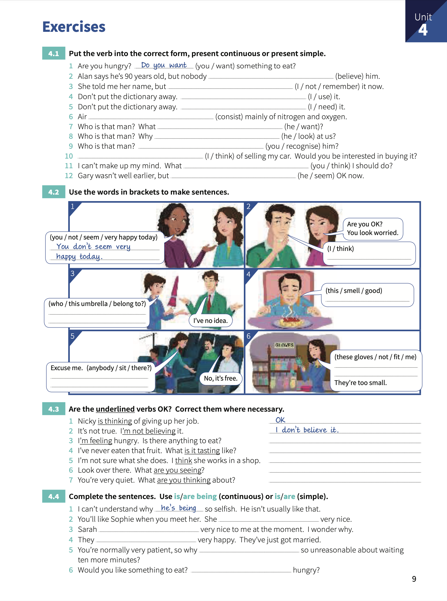

# Unit 4: Present continuous and present simple 2. `I'm doing` and `I do`.

## Concepts
> _Present continuous_ is used for `actions` and `happenings` that have started but not finished.
>
> The following verbs **aren't** used in _present continuous_: `like`, `want`, `need`, `prefer`, `know`, `realise`, `understand`, `recognise`, `believe`, `suppose`, `remember`, `mean`, `belong`, `fit`, `contain`, `consist` and `seem`.
>
> When `think` means `believe` or `have an opinion`, we **don't** use the _present continuous_. If `think` means `consider` then we use _present continuous_.
>
> We use _present simple_ with: `see`, `hear`, `smell` and `taste`. We can use _present simple_ or _present continuous_ with `look` and `feel`.
>
> We use `am/are/is` `being` to say how a person is **behaving** now. That means the person is doing something they can control.

## Exercises:

1. Put the verb into the correct form, _present continuous_ or _present simple_.

    1. Are you hungry? _Do you want_ something to eat?.
    2. Alan says he's 90 years old, but nobody **believes** him.
    3. She told me her name, but **I don't remember** it now.
    4. Don't put the dictionary away. **I'm using** it.
    5. Don't put the dictionary away. **I need** it.
    6. Air **consists** mainly of nitrogen and oxygen.
    7. Who is that man? What **does he want**?.
    8. Who is that man? Why **is he looking** at us?.
    9. Who is that man? **Do you recognise** him?.
    10. **I'm thinking** of selling my car. Would you be interested in buying it?.
    11. I can't make up my mind. What **do you think** I should do?.
    12. Gary wasn't well earlier, but **he seems** OK now.

2. Use the words in brackets to make sentences.

    1. _You don't seem very happy today_,
    2. Are you OK? You look worried. **I think** so.
    3. **Who is this umbrella belong to?**. I've no idea.
    4. **This smells good**.
    5. Excuse me. **Does anybody sit there?** No, It's free.
    6. **These gloves don't fit me** They're too small.

3. Are the underlined verbs OK?. Correct them where necessary.

    1. Nicky _is thinking_ of giving up her job. - _OK_.
    2. It's not true. I'_m not believing_ it. - _I don't believe it_.
    3. I' _m feeling_ hungry. Is there anything to eat?. - **OK**.
    4. I've never eaten that fruit. What _is it tasting_ like?. - **What does it taste like?**.
    5. I'm not sure what she does. I _think_ she works in a shop. - **OK**.
    6. Look over there. What _are you seeing_?. - **What do you see?**.
    7. You're very quiet. What _are you thinking_ about? - **What do you think about?**

4. Complete the sentences. Use `is/are` `being` (continuous) or `is/are` (simple).

    1. I can't understand why _he's being_ so selfish. He isn't usually like that.
    2. You'll like Sophie when you meet her. She **is** very nice.
    3. Sarah **is being** very nice to me at the moment. I wonder why.
    4. They **are** very happy. They've just gor married.
    5. You're normally very patient, so why **are you being** so unreasonable about waiting ten more minutes?.
    6. Would you like something to eat? **Are you** hungry?