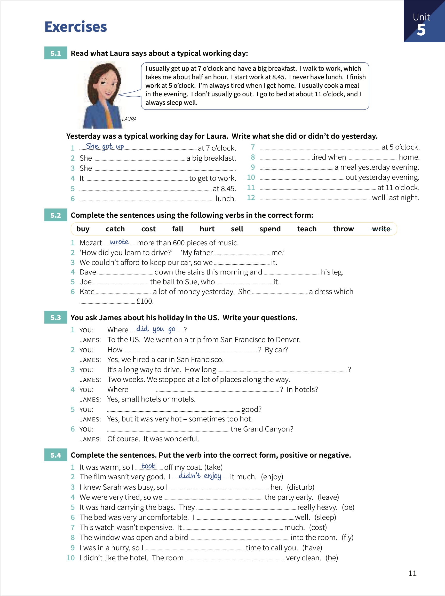

# Unit 5: Past simple. `I did`.

## Concepts:

> Very often the _past simple_ ends in **-ed** **(regular verbs)**, but many verbs are **irregular verbs**.
> 
> For _questions_ and _negative sentences_ we use **did/didn't** + infinitive verb.
> 
> The past of the _verb to be_ (am/are/is) is was/were.

## Exercises.

1. Read what Laura says about a typical working day.

    1. _She got up_ at 7 o'clock.
    2. She **had** a big breakfast.
    3. She **walked** to work.
    4. It **took her half an hour** to get to work.
    5. **She started to work** at 8:45.
    6. **She didn't had** luch.
    7. **She finished work** at 5 o'clock.
    8. **She's always** tired when **She got** home.
    9. **She cooked** a meal yesterday evening.
    10. **She didn't go** out yesterday evening.
    11. **She went to bed** at 11 o'clock.
    12. **She slept** well last night.

2. Complete the sentences using the following verbs in the correct form:

    1. Mozart _wrote_ more than 600 pieces of music.
    2. How did you learn to drive?. My father **taught** me.
    3. We couldn't afford to keep our car, so we **sold** it.
    4. Dave **fell** down the stairs this morning and **hurt** his leg.
    5. Joe **threw** the ball to Sue, who **caught** it.
    6. Kate **spent** a lot of money yesterday. She **bought** a dress which **costed** £100.

3. You ask James about his holiday in the US. Write the questions.

    1. Where _did you go_?. Yo the US. We went on a trip from San Francisco to Denver.
    2. How **did you move**? By car?. Yes, we hired a car in San Francisco.
    3. It's a long way to drive. How long **did you drive**?. Two weeks. We stopped at a lot os places along the way.
    4. Where **did you stay**? In hotel?. Yes, small hotels or motels.
    5. *Did the weather so*** good?. Yes, but it was very hot - sometines too hot.
    6. **Did you meet** the Grand Canyon?. Of course. It was wonderful.

4. Complete the sentences. Put the verb into the correct form, positive or negative.

    1. It was warm, so I _took_ off my coat.
    2. The film wasn't very good. I _didn't enjoy_ it much.
    3. I knew Sarah was busy, so I **didn't disturb** her.
    4. We were very tired, so we **left** the party early.
    5. It was hard carrying the bags. They **were** really heavy.
    6. The bed was very uncomfortable. I **didn't sleep** well.
    7. This watch wasn't expensive. It **didn't cost** much.
    8. The window was open and a bird **flew** into the room.
    9. I was in a hurry, so I **didn't have** time to call you.
    10. I didn't like the hotel. The room **wasn't** very clean.