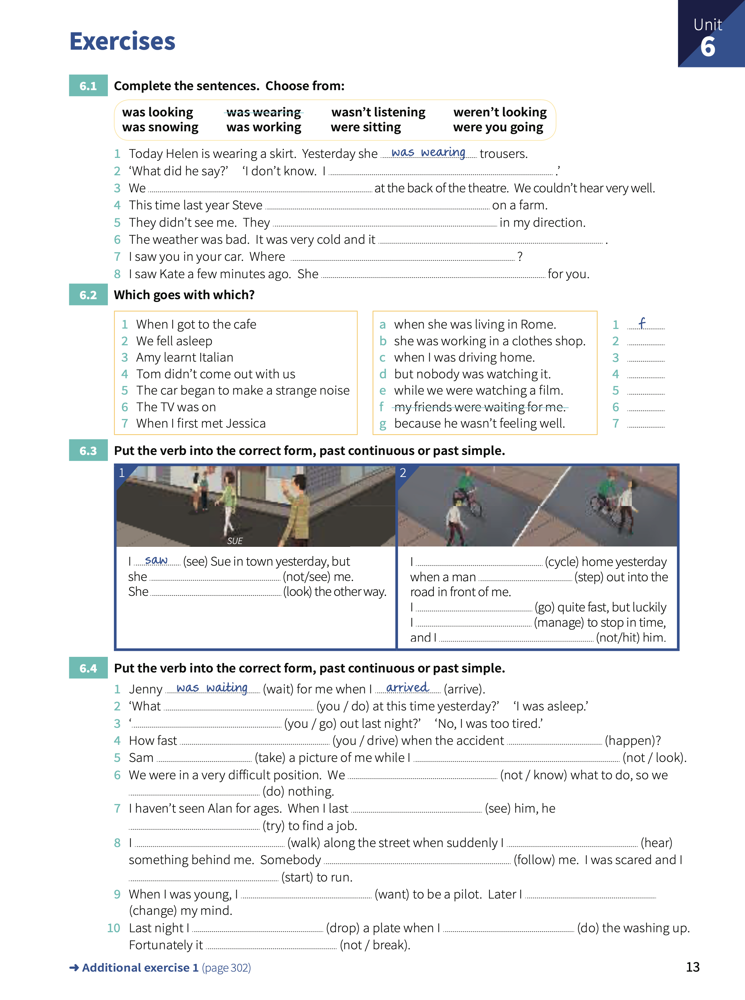

# Unit 6: Past continuous - `I was doing`.

## Concepts:

> It means `in the middle of` doing something at a certain time. The action or situation started before this time, but had not finished.
>
> `was`/`were` + `ing` is the _past continuous_.
> 
> You can say that something **happened** (_past simple_) **in the middle of** something else (_past continuous_).
> 
> We use the _past simple_ to say that one thing **happened** after another.

## Exercises:

1. Complete the sentences. Choose from:

    1. Today Helen is wearing a skirt. Yesterday she _was wearing_ trousers.
    2. What did he say?. I don't know. I **wasn't listening**.
    3. We **were sitting** at the back of the theatre. We couldn't hear veary well.
    4. This time last year Steve **was working** on a farm.
    5. They didn't see me. They **weren't looking** in my direction.
    6. The weather was bad. It was very cold and it **was snowing**.
    7. I saw you in your car. Where **were you going**?.
    8. I saw Kate a few minutes ago. She **was looking** for you.

2. Which goes with which?

    1. When I got to the cafe. My friends were waiting for me. - **F**.
    2. We fell asleep. while we were watching a film. - **E**.
    3. Amy learnt Italian. When she was living in Rome. - **A**.
    4. Tom didn't come out with us. becase he wasn't feeling well. - **G**.
    5. The car began to make a strange noise. when I was driving home. - **C**.
    6. The TV was on. but nobody was watching it. - **D**
    7. When I first met Jessica. She was working in a clothes shop. - **B**.

3. Put the verb into the correct form, _past continuous_ or _past simple_.

    - I _saw_ Sue in town yesterday, but she **didn't see** me. She **was looking** the other way.
    - I **was cycling** home yesterday when a man **stepped** out into the road in front of me. I **was going** quiet fast, but luckily I **managed** to stop in time, and I **didn't hit** him.

4. Put the verb into the correct form, _past continuous_ or _past simple_.

    1. Jenny _was waiting_ for me when I _arrived_.
    2. What **did you do** at this time yesterday?, I was asleep.
    3. **Did you go** out last night?. No, I was too tired.
    4. How fast **were you driving** when the accident **happened**?
    5. Sam **took** a picture of me while I **wasn't looking**.
    6. We were in a very difficult position. We **didn't know** what to do, so we **weren't doing** nothing.
    7. I haven't seen Alan for ages. When I last **saw** him, he **was trying** to find a job.
    8. I **was walking** along the street when suddenly I **heard** something behind me. Somebody **was following** me. I was scared and I **started** to run.
    9. When I was young, I **wanted** to be a pilot. Later I **changed** my mind.
    10. Last night I **dropped** a plate when I **was doing** the washing up. Fortunately it **didn't break**.