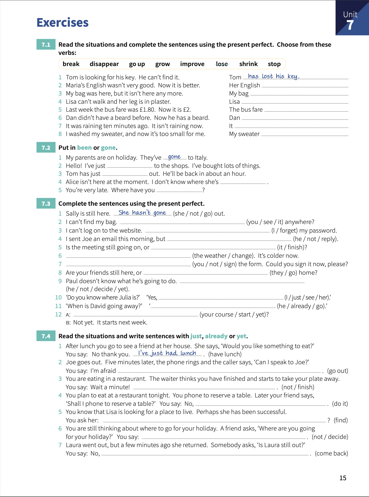

# Unit 7: Present perfect 1 - `I have done`.

## Concepts

> `subject` + `have/has` + `past participle`.
>
> `PP` often ends in **-ed**, but many verbs are irregular.
> 
> When we say something **has happened**, this is usually new information.
> 
> When we use the present perfect, there is a connection with  _now_. **The action in the past has a result now**.
> 
> We can use `just`, `already` and `yet`. `Just` means _a short time ago_. `Already` means _sooner than expected_. `Yet` means _until now_ and we also use it with QW and negative sentences.

## Exercises

1. Read the situations and complete the sentences using the _present perfect_. Choose from these verbs.
   
    1. Tom is looking for his key. He can't find it. Tom _has lost his key_.
    2. Maria's English wasn't very good. Now it is better. Her English **has improved**.
    3. My bag was here, but it isn't here any more. My bag **has disappeared**.
    4. Lisa can't walk and her leg is in plaster. Lisa **has broken her leg**.
    5. Last week the bus fare was £1.80. Now it is £2. The bus fare **has gone up**.
    6. Dan didn't have a beard before. Now he has a beard. Dan **has grown his beard**.
    7. It was raining ten minutes ago. It isn't raining now. It **has stopped**.
    8. I washed my sweater, and now it's too small for me. My sweater **has shrunk**.

2. Put in `been` or `gone`.

    1. My parents are on holiday. The've _gone_ to Italy.
    2. Hello!. I've just **gone** to the shops. I've bought lots of things.
    3. Tom has just **gone** out. He'll be back in about an hour.
    4. Alice isn't here at the moment. I don't know where she's **gone**.
    5. You're very late. Where have you **been**?

3. Complete the sentences using the _present perfect_.

    1. Sally is still here. _She hasn't gone_ out.
    2. I can't find my bag. **Have you seen it** anywhere?.
    3. I can't log on to the website. **I've forgotten** my password.
    4. I sent Joe an email this morning, but **He hasn't replied**.
    5. Is the meeting still going on, or **has it finished**?
    6. **The weather has changed**. It's colder now.
    7. **You haven't signed** the form. Could you sign it now, please?
    8. Are your friends still here, or **Have they gone** home?.
    9. Paul doesn't know what he's going to do. **He hasn't decided yet**.
    10. Do you know where Julia is?. Yes, **I've just seen her**.
    11. When is David going away?. **He's already gone**.
    12. **Has your course started yet**?. Not yet. It starts next week.

4. Read the situations and write sentences with `just`, `already` or `yet`.

    1. After lunch you go to see a friend at her house. She says "Would you like something to eat?". You say: No thank you. _I've just had lunch_.
    2. Joe goes out. Five minutes later, the phone rings and the caller says "Can I speak to Joe?". You say: I'm afraid. **He's just gone out**.
    3. You are eating in a restaurant. The waiter thinks you have finished and start to take your plate away. You say: Wait a minute!. **I haven't finished yet**.
    4. You plan to eat at a restaurant tonight. You phone to reserve a table. Later your friend says, "Shall I phone to reserve a table?". You say: **I've already done it**.
    5. You know that Lisa is looking for a place to live. Perhaps she has been successful. You ask her: **Have you already find a place**?
    6. You are still thinking about where to go for your holiday. A friend asks "Where are you going for your holiday?". You say: **I havent' decided yet**.
    7. Laura went out, but a few minutes ago she returned. Somebody asks "Is Laura still out?". You say: No, **She's just come back**.