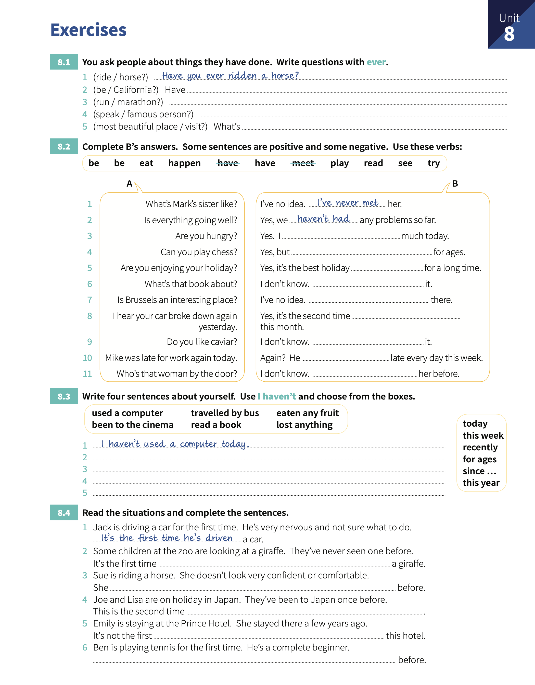

# Unit 8: Present perfect 2 - `I have done`

## Concepts

> When we talk about _a period of time_ that continues from the past until now, we use the **present perfect**.
> 
> We can use `recently`, `in the last few days`, `so far`, `since I arrived`, etc. **past ---> now**.
> 
> We can use `today`, `this evening`, `this year`, etc. when these periods are not finished at the time of speaking. **past ---> now --->**.

## Exercises.

1. You ask people about things they have done. Write questions with `ever`.

    1. _Have you ever ridden a horse?_.
    2. **Have you ever been in California?**.
    3. **Have you ever run a marathon?**.
    4. **Have you ever spoken to a famous person?**.
    5. **What's the most beautiful place have you ever visited?**

2. Complete B's answers. Some sentences are positives and somme negative. Use these verbs.

    1. What's Mark's sister like?. I've no idea. _I've never met_ her.
    2. Is everything going well?. Yes, we _haven't had_ any problems so far.
    3. Are you hungry?. Yes, I **haven't eaten** much today.
    4. Can you play chess?. Yes, but **I haven't played** for ages.
    5. Are you enjoying your holiday?. Yes, It's the best holiday **I've had** for a long time.
    6. What's that book about?. I don't know. **I haven't read** it.
    7. Is Brussels an interesting place?. I've no idea. **I haven't been** there.
    8. I hear your car broke down again yestersday. Yes, It's the sencond time **it's happened** this month.
    9. Do you like caviar?. I don't know. **I haven't tried** it.
    10. Mike was late for work again today. Again?. He **has been** late every day this week.
    11. Who's that woman by the door?. I don't know. **I haven't seen** her before.

3. Write four sentences about yourself. Use _I haven't_ and choose from the boxes.

    1. _I haven't used a computer today_.
    2. **I haven't travelled by bus this week**.
    3. **I haven't been to the cinema recently**.
    4. **I haven't lost anything this year**.
    5. **I haven't read a book for ages**.

4. Read the situations and complete the sentences.

    1. Jack is driving a car for the first time. He's very nervous and not sure what to do. _It's the first time he's driven_ a car.
    2. Some children at the zoo are looking at a giraffe. They've never seen on before. It's the first time **they've seen** a giraffe.
    3. Sue is riding a horse. She doesn't look very confident or comfortable. She **hasn't ridden** before. 
    4. Joe and Lisa are on holiday in Japan. They've been to Japan once before. This is the second time **they've been**.
    5. Emily is staying at the Prince Hotel. She stayed there a few years ago. It's not the first **time at** this hotel.
    6. Ben is playing tennis for the first time. He's a complete beginner. **He hasn't played** before.