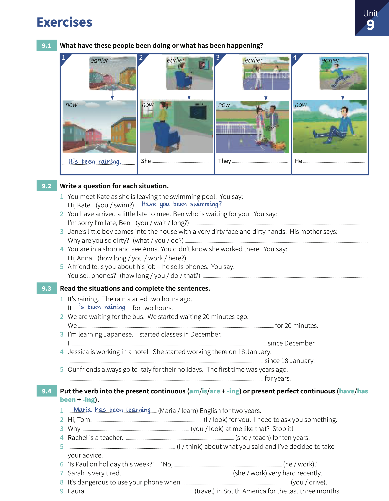

# Unit 9: Present perfect continuous - `I have been doing`.

# Concepts:

> We use _present perfect continuous_ for **an activity that has recently stopped or just stopped**

> `subject` + `have/has` + `been` + `-ing`
>
> We use _present perfect continuous_ especially with `how long`, `for` and `since`. **The activity is still happening** or **has just stopped**.
> 
> You can use the _present perfect continuous_ for repeated actions (`for`, `since`). 

## Exercises:

1. What have these people been doing or what has been happening?

    1. _It's been raining_.
    2. **She's been watching TV**.
    3. **They've been playing tennis**.
    4. **He's been running**.

2. Write a question for each situation.

    1. You meet Kate as she is leaving the swimming pool. You say: Hi Kate. _Have you been swimming_?.
    2. You have arrived a little late to meet Ben who is waiting for you. You say: I'm sorry I'm late, Ben. **How long have you been waiting?**.
    3. Jane's little boy comes into the house with a very dirty face and dirty hands. His mother says: Why are you so dirty?. **What have you been doing**?.
    4. You are in a shop and see Anna. You didn't know she worked there. You say: Hi Anna. **How long have you been working here**?.
    5. A friend tells you about his job. He sells phones. You say: You sell phones?. **How long have you been doing that**?.

3. Read the situations and complete the sentences.

    1. It's raining. The rain started two hours ago. It _'s been raining_ for two hours.
    2. We are waiting for the bus. We started waiting 20 minutes ago. We **'ve been waiting** for 20 minutes.
    3. I'm learning Japanese. I started classes in December. I **'ve learning Japanese** since December.
    4. Jessica is working is a hotel. She started working there on 18 January. **She's been working there** since 18 January.
    5. Our friends always go to Italy for their holidays. The first time was years ago. **They've been going to Italy** for years.

4. Put the verb into the _present continuous_ (`am/is/are` + `-ing`) or _present perfect continuous_ (`have/has` + `been` + `-ing`).

    1. _Maria has been learning_ English for two years.
    2. Hi, Tom. **I've been looking** for you. I need to ask you something.
    3. Why **are you looking** at me like that?. Stop it!.
    4. Rachel is a teacher. **She's been teaching** for ten years.
    5. **I've been thinking** about what you said and I've decide to take your advice.
    6. Is Paul on holiday this week?. No, **He's working**.
    7. Sarah is very tired. **She's been working** very hard recently.
    8. It's dangerous to use your phone when **you're driving**.
    9. Laura **has been traveling** in South America for the last three months.