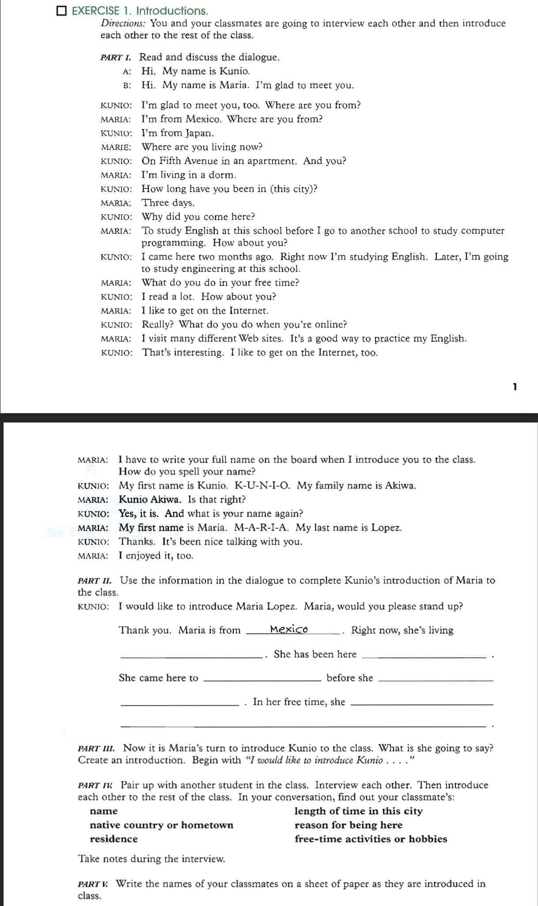

# Exercise 1: Introductions

## Part II.

I would like to introduce Maria Lopez, would you please stand up?.

Thank you. Maria is from _Mexico_. Right now, she's living **in a dorm**. She has been here **three days**. She came here to **study English at this school** before she **goes to another school to study computer programming**. In her free time, she **likes to get on the internet**.

## Part III.

**I would like to introduce Kunio Akiwa**.

**Kunio is from Japan. Right now she's living on Fifth Avenue in an apartment. She has been here two months. She came here to study english before she goes to study engineering at this school. In her free time, she likes read a lot.**