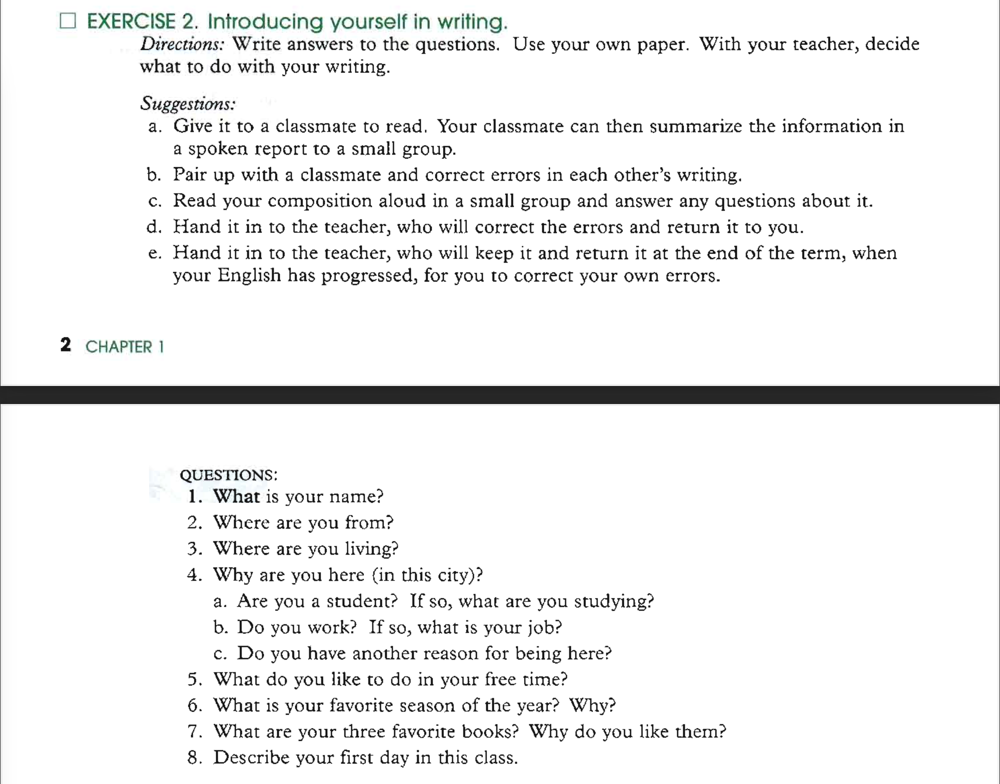

# Exercise 2: Introducing yourself in writting

**My name is Franti Huaman. I'm from Perú. I live in Lima. I'm here since my birth. In my free time I like to read books and spend time with my family. My favorite season of the year is winter because the weather is beautiful. I have a lot of favorite books but the main are `Why we sleep`, `The power of habits` and `Mental Models` because they teach me a lot about human behaviour. I'm a shy person and usually when I arrive to a new class I don't talk with people.**