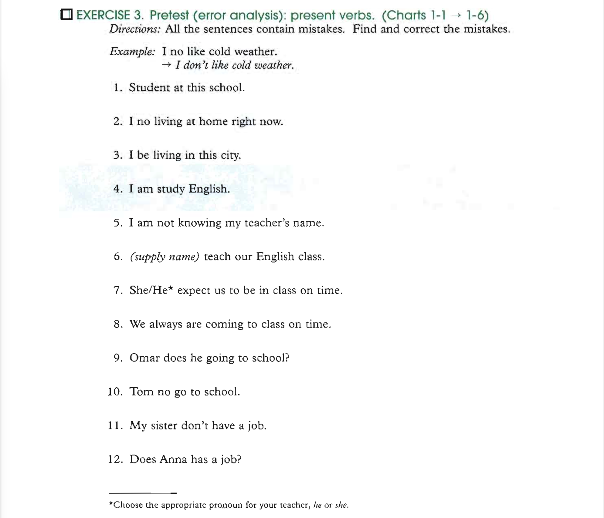

# Exercise 3 - Pretest (error analysis): present verbs.

(_You can see the charts here: [1.1](images/charts-1.1.png), [1.2](images/charts-1.2.png), [1.3](images/charts-1.3.png), [1.4](images/charts-1.4.png), [1.5](images/charts-1.5.png), [1.6](images/charts-1.6.png), [1.7](images/charts-1.7.png)_)

1. Student at this school. - **Student at school**.
2. I no living at home right now. - **I'm not living at home right now**.
3. I be living in this city. - **I'm living in this city**.
4. I am study English. - **I'm studying English**.
5. I am not knowing my teacher's name. - **I don't know my teacher's name**.
6. Carlos teach our English class. - **Carlos teaches our English class**.
7. He expect us to be in class on time. - **He expects us to be in class on time**.
8. We always are coming to class on time. - ****.
9. Omar does he going to school? - **Does Omar/is going to school**.
10. Tom no go to school. - **Tom doesn't go to school**.
11. My sister don't have a job. - **My sister doesn't have a job**.
12. Does Ana has a job? - **Does Ana have a job?**.