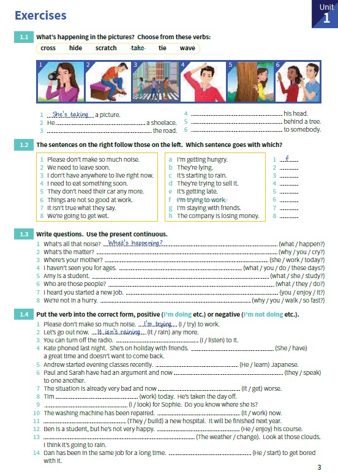

# Exercises

## 1.1 What's happening in the pictures? Choose from these verbs:
_cross / hide / scratch / take / tie / wave_

1. _She's taking_ a picture.
2. He **'s tying** a shoelace.
3. **They're crossing** the road.
4. **He's scratching** his head.
5. **She's hiding** behind a tree.
6. **They're waving** to somebody.

## 1.2 The sentences on the right follow those on the left. Which sentences goes with which?

1. Please don't make so much noise. _I'm trying to work_ - F
2. We need to leave soon. **It's getting late** - E
3. I don't have anywhere to live right now. **I'm staying with friends** - G
4. I need to eat something soon. **I'm getting hungry** - A
5. They don't need their car any more. **The're trying to sell it** - D
6. Things are not so good at work. **The company is losing money** - H
7. It isn't true what they say. **They're lying** - B
8. Wew're going to get wet. **It's starting to rain** - C

## 1.3 Write questions. Use the present continuous.

1. What's all that noise?. _What's happening?_.
2. What's the matter?. **What's going on?**.
3. Where's your mother? **What is your mother doing**.
4. I haven't seen you for ages. ****.
5. Amy is a student. **What is Amy doing?**
6. Who are those people? ****.
7. I heard you started a new job. ****.
8. We're not in a hurry. ****.

## 1.4 Put the verb into the correct form, positive or negative.

1. Please don't make so much noise. __I'm trying_ to work.
2. Let's go out now. _It isn't raining_ anymore.
3. You can turn off the radio. **I'm not listening** to it.
4. Kate phoned last night. She's on holiday with friends. **She's having** a great time and doesn't want to come back.
5. Andrew started evening classes recently. **He's learning Japanese**.
6. Paul and Sara have had an argument and now **they are speaking** to one another.
7. The situation is already very bad and now **it's getting worse**.
8. Tim **isn't working** today. He's taken the day off.
9. **I'm looking** for Sophie. Do you know where she is?
10. The washing machine has been repaired. **It's working** now.
11. **They're building** a new hospital. It will be finished next year.
12. Ben is a student, but he's not very happy. **He's enjoying** his course.
13. **The weather is changing**. Look at those clouds. I think it's going to rain.
14. Dan has been in the same job for a long time. **He's starting** to get bored with it.